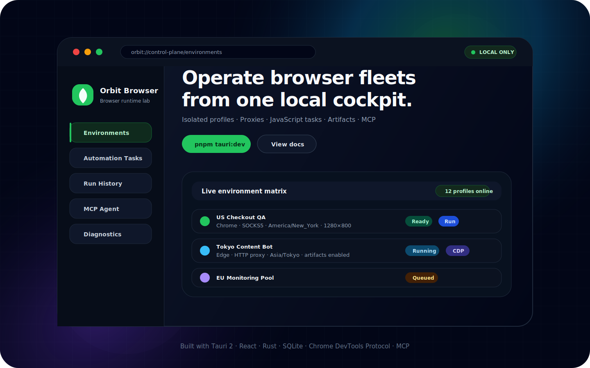
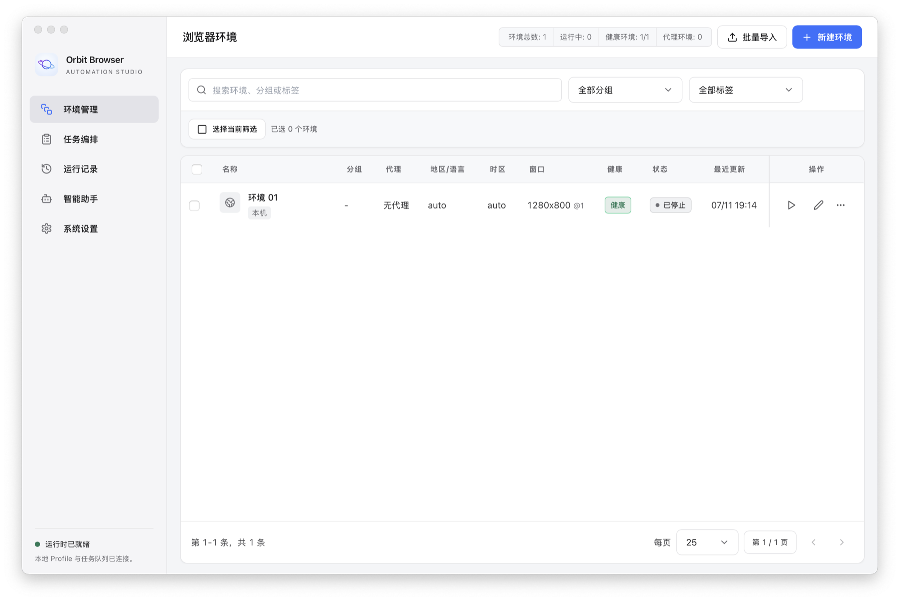
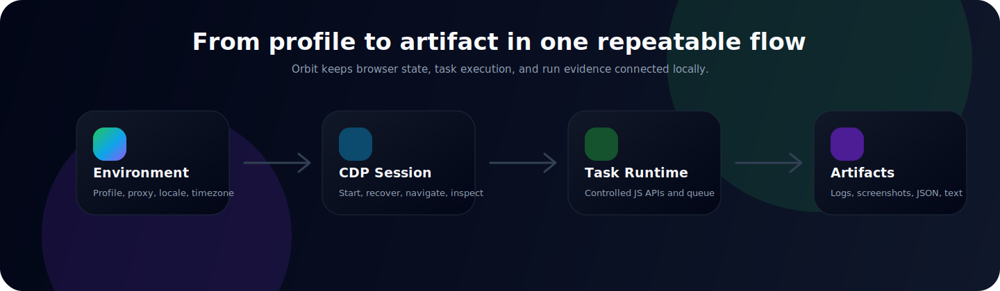

<div align="center">
  

  <h1>Orbit Browser</h1>

  <p>
    <strong>Operate isolated browser fleets from one local cockpit.</strong>
  </p>

  <p>
    Profiles, proxies, JavaScript automation, run artifacts, and MCP tools — stitched together in a fast desktop app.
  </p>

  <p>
    <a href="README.zh-CN.md">简体中文</a>
    ·
    <a href="docs/architecture.md">Architecture</a>
    ·
    <a href="docs/automation-api.md">Automation API</a>
    ·
    <a href="docs/mcp-api.md">MCP API</a>
  </p>

  <p>
    
    
    
    
  </p>
</div>

---

## Product Preview

<p align="center">
  
</p>

Orbit Browser running on macOS, with isolated environments, proxy status, and
browser runtime controls in one local desktop control plane.

## Why Orbit Browser?

Modern browser automation often becomes a pile of scripts, temporary profiles,
proxy flags, screenshots, stale state, and scattered logs.

**Orbit Browser turns that chaos into a local desktop control plane.**

Create isolated browser environments, bind proxies and runtime settings,
run repeatable JavaScript tasks, inspect logs and artifacts, and expose the same
capabilities to local agents through MCP — all backed by local SQLite storage.

```text
[Environment] → [Browser profile + proxy + runtime policy]
      │
      ├── start / stop / recover
      ├── run automation tasks
      └── collect logs, screenshots, JSON, text artifacts
```

## At a Glance

<table>
  <tr>
    <td><strong>Runtime</strong></td>
    <td>Local Tauri desktop app backed by Rust, SQLite, and Chrome DevTools Protocol.</td>
  </tr>
  <tr>
    <td><strong>Control plane</strong></td>
    <td>Manage environments, tasks, run history, diagnostics, settings, and MCP access.</td>
  </tr>
  <tr>
    <td><strong>Automation</strong></td>
    <td>Run controlled JavaScript tasks with page APIs, logging, screenshots, and artifacts.</td>
  </tr>
  <tr>
    <td><strong>Best fit</strong></td>
    <td>QA labs, proxy workflows, scraping pipelines, monitoring, and local AI-agent browsing.</td>
  </tr>
</table>

## Highlights

- **Isolated browser fleets**  
  Manage Chrome, Chromium, Edge, or Camoufox profiles with independent storage,
  proxies, tags, groups, and launch options. Chrome keeps its native browser
  User-Agent, platform, and font identity while matching its native language
  preference, Intl locale, CDP timezone, and geolocation to the proxy exit IP;
  Camoufox provides the extended fingerprint profile.

- **Proxy-first workflow**  
  Configure HTTP, HTTPS, SOCKS4, SOCKS5, proxy authentication, bypass lists, and
  per-environment proxy checks.

- **Repeatable task execution**  
  Save JavaScript automation tasks, run them across one or many environments,
  control concurrency, retry failures, and cancel active batches.

- **Inspectable local artifacts**  
  Capture screenshots, JSON, text outputs, logs, run metadata, and open artifact
  folders directly from the desktop UI.

- **Agent-ready MCP server**  
  Launch Orbit as a local stdio MCP server and let agent clients inspect
  environments, operate browser pages, execute tasks, and read artifacts.

- **Local-first by design**  
  Runtime state, profiles, runs, logs, and settings stay on your machine.

## What You Can Build With It

- Multi-account QA and regression browser labs
- Proxy and region-specific browsing workflows
- Reusable scraping and monitoring tasks
- Local browser automation for AI agents
- Repeatable login-state, screenshot, and page-inspection pipelines
- Desktop-controlled CDP automation without managing raw Chrome processes

## Workflow



## Capability Map

```text
Orbit Browser
├── Browser environments
│   ├── Isolated Chrome / Chromium / Edge profiles
│   ├── Chrome exit-IP language + CDP timezone/geolocation
│   ├── Camoufox extended runtime profile
│   └── Start, stop, restart, recover, diagnose
├── Automation tasks
│   ├── Controlled JavaScript runtime
│   ├── Multi-environment batch execution
│   └── Concurrency, timeout, retry, cancellation
├── Run evidence
│   ├── Logs, statuses, timings, attempts
│   ├── Screenshots, JSON outputs, text files
│   └── Local artifact folders
└── Agent interface
    ├── MCP stdio server
    ├── Page navigation, evaluation, screenshots
    └── Environment/task/run inspection
```

## Product Tour

### 1. Create browser environments

Define dedicated browser contexts for different accounts, regions, projects, or
workflows. Each environment can own its profile, proxy, start URL, and runtime
policy. Chrome automatically aligns native language preferences, Intl locale,
CDP timezone, and geolocation with the proxy exit IP while preserving native
UA, platform, and font signals. Camoufox exposes the extended locale, viewport,
platform, and WebRTC profile.

### 2. Run automation tasks

Write concise scripts with controlled globals such as `page`, `log`, `run`,
`env`, and `sleep`.

```js
await page.goto("https://example.com", { waitUntil: "load" });
const title = await page.title();
log.info(`Page title: ${title}`);
await page.screenshot("home");
await run.outputJson("page-title", { title });
```

### 3. Inspect every run

Each task run records status, timing, logs, screenshots, JSON outputs, text
outputs, and artifact locations. Failed runs can be retried without losing the
previous execution trail.

### 4. Connect local agents

Run the desktop binary as an MCP stdio server:

```bash
orbit-browser --mcp
```

Agent clients can then call Orbit tools to list environments, start browsers,
navigate pages, evaluate JavaScript, capture screenshots, run saved tasks, and
read run artifacts.

## Tech Stack

- **Desktop shell**: Tauri 2
- **Frontend**: React 18, TypeScript, Vite, Tailwind CSS
- **Runtime core**: Rust, SQLite, Chrome DevTools Protocol, `deno_core`
- **Automation surface**: Controlled JavaScript runtime + MCP stdio server
- **Package manager**: pnpm

## 30-Second Start

```bash
pnpm install
pnpm tauri:dev
```

Then create an environment, save a task, choose target environments, and run.

## Quick Start

### Requirements

- Node.js 20+
- pnpm 10+
- Rust stable
- Chrome, Chromium, or Edge
- Platform dependencies required by Tauri 2

Linux dependencies are listed in the GitHub Actions workflow.

### Install

```bash
pnpm install
```

### Run the desktop app

```bash
pnpm tauri:dev
```

### Build

```bash
pnpm build
pnpm tauri:build
```

### Test

```bash
pnpm test:rust
```

Run the ignored browser runtime smoke test when changing Chrome launch or CDP
behavior:

```bash
cargo test --manifest-path src-tauri/Cargo.toml browser_runtime_smoke_executes_js_task -- --ignored --nocapture
```

### Full verification

```bash
pnpm check
```

## Repository Layout

```text
├── src/                    React/Tailwind desktop UI
├── src-tauri/              Rust/Tauri core, SQLite, Chrome lifecycle, queue
├── docs/                   Architecture, automation, MCP, and release notes
├── public/                 Static web assets
├── .github/workflows/      CI, verification, and release packaging
├── CHANGELOG.md            Release history
└── README.md               Project overview
```

## Documentation

- [Architecture](docs/architecture.md)
- [Automation API](docs/automation-api.md)
- [MCP API](docs/mcp-api.md)
- [Release Process](docs/release.md)
- [Contributing Guide](CONTRIBUTING.md)
- [Security Policy](SECURITY.md)

## Data And Security

Orbit Browser stores local application data in the system app-data directory.
Do not commit generated runtime files, including:

- Browser profiles
- Cookies and storage state
- Proxy credentials
- Task screenshots and run artifacts
- SQLite databases
- Local `.env` files

## Release Notes

The release workflow builds desktop bundles for macOS, Windows, and Linux when a
version tag is pushed.

- Windows: download `-setup.exe` and run new versions directly without manually
  uninstalling the previous release.
- macOS: download the matching `.dmg` and drag the app to Applications.
- Linux: choose AppImage, deb, or rpm; deb and rpm support package-manager upgrades.

Normal upgrades preserve environments, tasks, browser profiles, and run history.

```bash
git tag v0.3.2
git push origin v0.3.2
```

See [Release Process](docs/release.md) for the full packaging flow.

## Status

Orbit Browser is in an early usable stage, but the product loop is already useful: create environments, launch browsers, run tasks, inspect evidence, and expose it all through MCP.

The core desktop workflow, local storage, Chrome lifecycle, task queue, run artifacts, diagnostics, and MCP server are already wired.

## License

MIT License. See [LICENSE](LICENSE).
